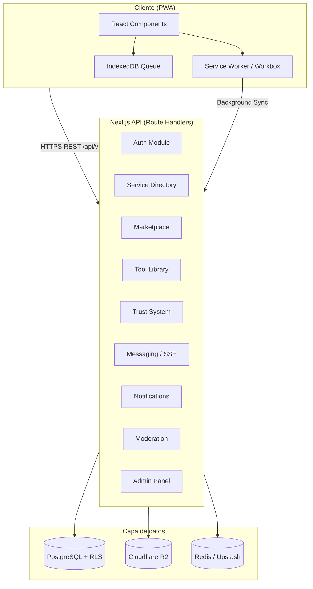
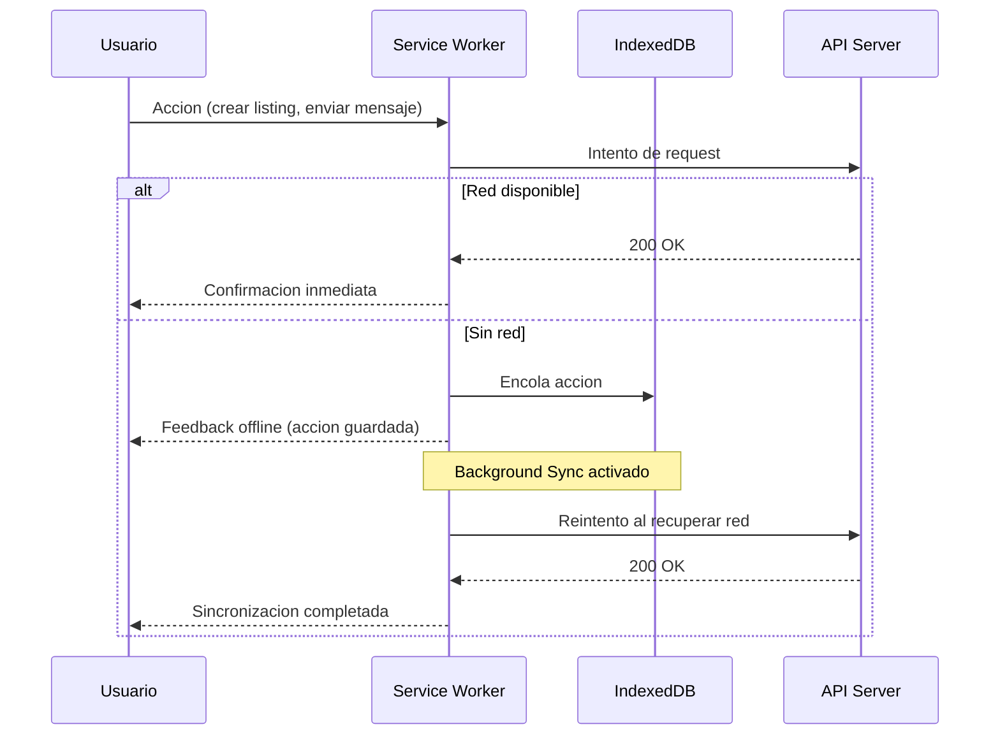
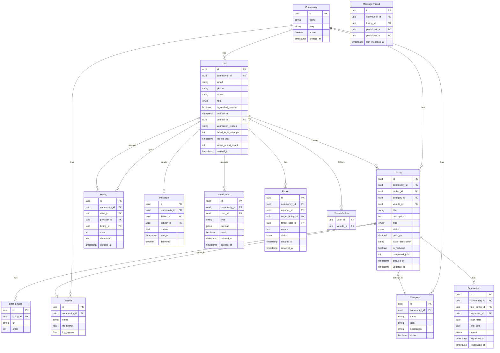

# Design Document — Santa Elena Platform

## Overview

Santa Elena Platform es una Progressive Web App (PWA) tipo marketplace comunitario para la comunidad rural de Santa Elena (Medellín, Colombia). El sistema permite a los vecinos publicar y encontrar servicios locales, intercambiar bienes y herramientas, y construir una red de confianza digital.

El diseño prioriza tres restricciones fundamentales:

- **Conectividad limitada**: soporte offline-first con sincronización automática al recuperar red.
- **Baja alfabetización digital**: flujos de máximo 3 pasos, lenguaje llano, elementos táctiles grandes.
- **Escalabilidad multi-comunidad**: arquitectura multi-tenant que permite replicar el modelo a otras zonas rurales sin redeploy.

### Stack tecnológico

| Capa | Tecnología | Justificación |
|---|---|---|
| Frontend | Next.js 14 (App Router) + React | SSR/SSG para carga rápida en 3G; ecosistema PWA maduro con `next-pwa` |
| Estilos | Tailwind CSS | Utilidades de tamaño táctil y diseño responsivo sin CSS personalizado |
| Estado cliente | Zustand + React Query | Estado local ligero; caché y sincronización de datos del servidor |
| Offline queue | Workbox (via next-pwa) + IndexedDB | Service worker para caché de assets; IndexedDB para cola de acciones pendientes |
| Backend API | Next.js Route Handlers (REST) | API versionada en el mismo repositorio; reduce latencia al eliminar round-trip adicional |
| Base de datos | PostgreSQL 16 con Row-Level Security | Multi-tenancy nativo; RLS garantiza aislamiento de zonas a nivel de BD |
| ORM | Prisma | Migraciones tipadas; soporte nativo para RLS via `$executeRaw` |
| Autenticación | NextAuth.js v5 | Soporte JWT + OAuth (Google); integración nativa con Next.js |
| Almacenamiento de imágenes | Cloudflare R2 (compatible S3) | Bajo costo; CDN global; límite de 5 MB por imagen |
| Notificaciones push | Web Push API + VAPID | Estándar PWA; sin dependencia de Firebase |
| Mensajería en tiempo real | Server-Sent Events (SSE) | Unidireccional servidor a cliente; funciona en redes 3G sin WebSocket overhead |
| Despliegue | Vercel (frontend) + Railway/Supabase (PostgreSQL) | Despliegue sin fricción; escalado automático |

---

## Architecture

El sistema sigue una arquitectura **monolito modular** con separación clara entre módulos de dominio. Se elige sobre microservicios para reducir la complejidad operacional en una etapa temprana, manteniendo la posibilidad de extraer módulos en el futuro.



### Multi-tenancy

Cada **comunidad** (`Community`) es un tenant. El aislamiento se implementa mediante:

1. Columna `community_id` en todas las tablas de negocio.
2. Políticas RLS de PostgreSQL que filtran automáticamente por `community_id` según el JWT del usuario.
3. El contexto de tenant se inyecta en cada request via middleware de Next.js (header `X-Community-ID` o subdominio).

### Flujo offline



---

## Components and Interfaces

### API REST versionada

Todos los endpoints siguen el prefijo `/api/v1/`. Los recursos principales son:

| Recurso | Endpoints principales |
|---|---|
| Auth | `POST /auth/register`, `POST /auth/login`, `POST /auth/verify`, `POST /auth/reset-password` |
| Listings | `GET /listings`, `POST /listings`, `GET /listings/:id`, `PATCH /listings/:id`, `DELETE /listings/:id` |
| Services | `GET /services`, `GET /services/:id` |
| Tools | `GET /tools`, `POST /tools`, `POST /tools/:id/reservations` |
| Ratings | `POST /ratings`, `GET /ratings?providerId=` |
| Messages | `GET /messages/:threadId`, `POST /messages`, `GET /messages/stream` (SSE) |
| Notifications | `GET /notifications`, `PATCH /notifications/:id/read` |
| Reports | `POST /reports` |
| Admin | `GET /admin/reports`, `POST /admin/categories`, `PATCH /admin/members/:id/suspend` |
| Communities | `GET /communities`, `POST /communities` |

### Estructura de módulos frontend

```
src/
  app/
    (public)/
      page.tsx            # Home con featured listings
      services/           # Directorio de servicios
      marketplace/        # Marketplace
    (auth)/
      dashboard/
      listings/new/
      messages/
      notifications/
      tools/
    admin/                # Panel de administracion
  components/
    ui/                   # Componentes base (Button, Input, Card)
    listings/             # ListingCard, ListingForm, ListingDetail
    trust/                # RatingStars, BadgeIcon, ReviewList
    messaging/            # MessageThread, MessageInput
    notifications/        # NotificationBell, NotificationList
    map/                  # VeredaMap, VeredaSelector
  lib/
    api/                  # Clientes fetch tipados
    auth/                 # NextAuth config
    offline/              # IndexedDB queue manager
    validations/          # Zod schemas compartidos
  hooks/
    useOfflineQueue.ts
    useNotifications.ts
    useGeolocation.ts
```

---

## Data Models

### Modelo entidad-relacion simplificado



### Notas de diseño de datos

- **Privacidad de ubicacion**: `Vereda.lat_approx` y `lng_approx` son coordenadas del centroide de la vereda, nunca coordenadas exactas del usuario.
- **Contador de reportes**: `User.active_report_count` se mantiene con un trigger de PostgreSQL para evitar conteos en tiempo real costosos.
- **Retencion de notificaciones**: `Notification.expires_at` se establece en `created_at + 90 days`; un job diario elimina las expiradas.
- **Exportacion JSON**: Todas las tablas de contenido generado por usuarios tienen una vista `v_export_{table}` que serializa los registros en JSONB para el endpoint de exportacion.
- **Enum `Listing.type`**: `service | sale | rent | trade | tool`
- **Enum `Listing.status`**: `active | inactive | flagged | pending_review`
- **Enum `Reservation.status`**: `pending | confirmed | cancelled | completed`
- **Enum `Report.status`**: `pending | resolved | dismissed`

---

## Correctness Properties

*Una propiedad es una caracteristica o comportamiento que debe mantenerse verdadero en todas las ejecuciones validas del sistema — esencialmente, una declaracion formal sobre lo que el sistema debe hacer. Las propiedades sirven como puente entre especificaciones legibles por humanos y garantias de correccion verificables automaticamente.*

### Property 1: Validacion de formato de registro

*Para cualquier* par de valores (telefono, email) enviados en el formulario de registro, el sistema debe aceptar unicamente aquellos que cumplan el formato de telefono colombiano valido y el formato de email RFC 5322. Cualquier otro valor debe ser rechazado con un error de validacion.

**Validates: Requirements 1.1**

---

### Property 2: Mensaje de error de duplicado no revela campo

*Para cualquier* combinacion de email duplicado, telefono duplicado, o ambos duplicados en un intento de registro, el mensaje de error devuelto por el sistema debe ser identico en todos los casos, sin revelar cual campo causo el conflicto.

**Validates: Requirements 1.4**

---

### Property 3: Contador de intentos fallidos incrementa siempre

*Para cualquier* par de credenciales invalidas enviadas al formulario de login, el contador de intentos fallidos del account correspondiente debe incrementarse en exactamente 1, y el mensaje de error devuelto debe ser generico (no revelar si el email o la contrasena son incorrectos).

**Validates: Requirements 1.6**

---

### Property 4: Filtro de categoria es exhaustivo

*Para cualquier* conjunto de listings y cualquier categoria seleccionada, todos los listings retornados por el directorio deben pertenecer exactamente a esa categoria, y ningun listing de otra categoria debe aparecer en los resultados.

**Validates: Requirements 2.2**

---

### Property 5: Filtros de directorio son correctos y componibles

*Para cualquier* combinacion de filtros aplicados simultaneamente (Vereda, rating minimo, disponibilidad), todos los listings retornados deben satisfacer todos los filtros aplicados. Ningun listing que viole cualquiera de los filtros activos debe aparecer en los resultados.

**Validates: Requirements 2.3, 2.4, 2.5**

---

### Property 6: Listings de proveedores verificados preceden a no verificados

*Para cualquier* conjunto de listings retornados sin orden explicito, todos los listings cuyo autor sea Verified_Provider deben aparecer antes que cualquier listing de un autor no verificado en la lista de resultados.

**Validates: Requirements 2.6**

---

### Property 7: Detalle de listing contiene todos los campos requeridos

*Para cualquier* listing de tipo servicio, la respuesta del endpoint de detalle debe contener: nombre del proveedor, categoria, vereda, rating promedio, numero de trabajos completados, descripcion, y opciones de contacto.

**Validates: Requirements 2.7**

---

### Property 8: Validacion de campos requeridos en creacion de listing

*Para cualquier* intento de creacion de listing que omita al menos uno de los campos requeridos (titulo, descripcion, tipo, vereda), el sistema debe rechazar la creacion con un error de validacion que identifique el campo faltante.

**Validates: Requirements 3.1, 8.1**

---

### Property 9: Validacion de imagenes en listings

*Para cualquier* conjunto de imagenes enviadas a un listing, el sistema debe aceptar unicamente conjuntos que cumplan simultaneamente: cantidad menor o igual a 5, cada imagen menor o igual a 5 MB, y formato JPEG o PNG. Cualquier conjunto que viole alguna de estas reglas debe ser rechazado.

**Validates: Requirements 3.4**

---

### Property 10: Bloqueo de creacion de listing por reportes activos

*Para cualquier* miembro con 3 o mas reportes activos no moderados, cualquier intento de crear un nuevo listing debe ser bloqueado por el sistema con un mensaje indicando que la cuenta esta bajo revision.

**Validates: Requirements 3.7**

---

### Property 11: Calculo correcto del rating promedio

*Para cualquier* conjunto no vacio de ratings numericos entre 1 y 5, el rating promedio calculado por el sistema debe ser igual a la media aritmetica del conjunto, redondeada a exactamente un decimal.

**Validates: Requirements 4.2**

---

### Property 12: Deduplicacion de ratings en ventana de 30 dias

*Para cualquier* par (miembro calificador, proveedor), si ya existe un rating enviado dentro de los ultimos 30 dias, cualquier intento de enviar un segundo rating debe ser rechazado por el sistema con un mensaje informativo.

**Validates: Requirements 4.6**

---

### Property 13: Limite de caracteres en comentarios de rating

*Para cualquier* string enviado como comentario de rating, el sistema debe aceptar unicamente strings de longitud menor o igual a 500 caracteres y rechazar cualquier string mas largo.

**Validates: Requirements 4.7**

---

### Property 14: Bloqueo de mensajeria para cuentas restringidas

*Para cualquier* miembro cuya cuenta este en estado `locked` o `under_review`, cualquier intento de enviar un mensaje interno debe ser bloqueado por el sistema.

**Validates: Requirements 5.6**

---

### Property 15: Privacidad de coordenadas en listings

*Para cualquier* listing o perfil de usuario, ninguna respuesta de la API publica debe contener coordenadas geograficas exactas. La ubicacion debe expresarse unicamente como nombre de vereda.

**Validates: Requirements 6.1**

---

### Property 16: Validacion de vereda contra lista predefinida

*Para cualquier* valor de vereda enviado en la creacion de un listing, el sistema debe aceptar unicamente valores que pertenezcan a la lista predefinida de veredas de la comunidad. Cualquier otro valor debe ser rechazado.

**Validates: Requirements 6.2**

---

### Property 17: Notificaciones no leidas ordenadas por fecha descendente

*Para cualquier* conjunto de notificaciones no leidas de un miembro, el panel de notificaciones debe mostrarlas ordenadas por `created_at` de forma descendente (mas reciente primero), sin excepcion.

**Validates: Requirements 7.5**

---

### Property 18: Suspension bloquea login y oculta listings

*Para cualquier* miembro suspendido por el administrador, el sistema debe simultaneamente: (a) rechazar cualquier intento de login de ese miembro, y (b) excluir todos sus listings activos de cualquier resultado de busqueda o listado publico.

**Validates: Requirements 9.3**

---

### Property 19: Deteccion de URLs y telefonos en contenido de listings

*Para cualquier* listing cuyo titulo o descripcion contenga una URL (patron `http://`, `https://`, o `www.`) o un numero de telefono (patron de 10 digitos colombiano), el sistema debe marcar automaticamente ese listing con estado `flagged` antes de publicarlo.

**Validates: Requirements 9.4**

---

### Property 20: Auto-suspension por umbral de reportes

*Para cualquier* miembro que acumule 5 o mas reportes dentro de una ventana de 30 dias, el sistema debe suspender automaticamente la cuenta y notificar al administrador, independientemente del estado de moderacion de los reportes individuales.

**Validates: Requirements 9.5**

---

### Property 21: Registro de verificacion de proveedor contiene todos los campos

*Para cualquier* accion de verificacion de Verified_Provider ejecutada por un administrador, el sistema debe persistir los tres campos requeridos: fecha de verificacion, ID del administrador, y razon de verificacion.

**Validates: Requirements 9.7**

---

### Property 22: Tamano minimo de elementos tactiles

*Para cualquier* elemento interactivo (boton, campo de formulario, item de navegacion) renderizado por la plataforma, su area tactil debe ser de al menos 44x44 pixeles CSS.

**Validates: Requirements 10.2**

---

### Property 23: Sincronizacion de acciones pendientes al recuperar red

*Para cualquier* conjunto de acciones encoladas durante un periodo offline, al restaurarse la conectividad de red, todas las acciones de la cola deben ser enviadas al servidor y procesadas, sin perdida de datos.

**Validates: Requirements 10.6**

---

### Property 24: Categoria desactivada no aparece en formularios pero preserva listings

*Para cualquier* categoria desactivada por el administrador, el sistema debe: (a) excluirla de los formularios de creacion de nuevos listings, y (b) preservar todos los listings existentes bajo esa categoria sin modificarlos.

**Validates: Requirements 11.2**

---

### Property 25: Limite de 5 listings destacados en home

*Para cualquier* intento de destacar un listing adicional cuando ya existen 5 listings destacados activos, el sistema debe rechazar la operacion o reemplazar uno existente, garantizando que el conteo de listings destacados nunca supere 5.

**Validates: Requirements 11.3**

---

### Property 26: Aislamiento de datos entre zonas comunitarias

*Para cualquier* par de comunidades distintas (A, B), ningun listing, miembro, o contenido perteneciente a la comunidad A debe ser visible o accesible desde el contexto de la comunidad B, y viceversa.

**Validates: Requirements 12.2**

---

### Property 27: Exportacion JSON preserva todos los datos

*Para cualquier* conjunto de contenido generado por usuarios, la exportacion en formato JSON debe preservar todos los campos y valores originales, y el JSON resultante debe ser valido y parseable.

**Validates: Requirements 12.4**

---

## Error Handling

### Formato uniforme de errores

Todos los errores de la API siguen este formato:

```json
{
  "error": {
    "code": "VALIDATION_ERROR",
    "message": "Descripcion legible en espanol",
    "field": "email",
    "requestId": "uuid"
  }
}
```

### Categorias de error

| Categoria | Codigo HTTP | Ejemplos |
|---|---|---|
| Validacion de entrada | 400 | Campo requerido faltante, formato invalido |
| Autenticacion | 401 | Token expirado, credenciales invalidas |
| Autorizacion | 403 | Accion no permitida para el rol del usuario |
| No encontrado | 404 | Listing o usuario inexistente |
| Conflicto | 409 | Email/telefono duplicado en registro |
| Rate limiting | 429 | Demasiados intentos de login |
| Error interno | 500 | Fallo de base de datos, error inesperado |

### Casos especificos

- **Registro con duplicados (Req. 1.4)**: El backend detecta el conflicto pero devuelve siempre el mismo mensaje generico `"Ya existe una cuenta con estos datos"`, sin especificar si es email o telefono.
- **Cuenta bloqueada (Req. 1.7)**: El endpoint de login devuelve 429 con header `Retry-After` indicando los segundos restantes del bloqueo.
- **Listing flaggeado automaticamente (Req. 9.4)**: El listing se crea con estado `flagged` y se devuelve 201 al autor con un aviso de que esta pendiente de revision.
- **Acciones offline fallidas**: Si una accion encolada falla al sincronizarse, se notifica al usuario con un mensaje especifico y se elimina de la cola.
- **Timeout de reserva (Req. 8.5)**: Un job de cron ejecuta cada hora y cancela reservas pendientes sin respuesta en 48 horas, enviando notificacion al solicitante.

### Resiliencia

- **Reintentos**: Las acciones offline se reintentaran con backoff exponencial (1s, 2s, 4s, maximo 3 intentos).
- **Circuit breaker**: Si el servicio de notificaciones push falla, las notificaciones se degradan gracefully a in-app unicamente.
- **Validacion en dos capas**: Zod schemas en el cliente (feedback inmediato) y en el servidor (fuente de verdad).

---

## Testing Strategy

### Enfoque dual

La estrategia combina tests de ejemplo (comportamientos concretos) con tests basados en propiedades (comportamientos universales).

#### Tests de propiedades (Property-Based Testing)

Se utiliza **fast-check** (TypeScript/JavaScript) como libreria de PBT. Cada test de propiedad ejecuta minimo **100 iteraciones** con inputs generados aleatoriamente.

Cada test de propiedad incluye un comentario de trazabilidad:

```typescript
// Feature: santa-elena-platform, Property N: <texto de la propiedad>
```

Los generadores clave son:

- `fc.emailAddress()` — emails validos e invalidos
- `fc.string()` — strings arbitrarios para comentarios, titulos, descripciones
- `fc.integer({ min: 0, max: 10 })` — valores de rating (incluyendo fuera de rango)
- `fc.array(fc.record({...}))` — conjuntos de listings con campos aleatorios
- `fc.constantFrom(...veredas)` — veredas validas e invalidas
- `fc.uuid()` — IDs de comunidades para tests de aislamiento multi-tenant

Las 27 propiedades definidas en la seccion anterior se implementan como tests de propiedad con fast-check.

#### Tests de ejemplo (Unit / Integration)

Los tests de ejemplo cubren:

- Flujos de autenticacion completos (registro, verificacion, login)
- Transiciones de estado de listings (activo a inactivo, activo a flagged)
- Flujo de reserva de herramientas (solicitud, aprobacion, completado)
- Moderacion de contenido (reporte, suspension, dismiss)
- Notificaciones (in-app y push)
- Integracion OAuth con Google (mock del proveedor)

#### Tests de humo (Smoke)

- Lighthouse CI en cada PR: Performance >= 70, Accessibility >= 85 en perfil Android 3G simulado.
- Verificacion de endpoints versionados de la API REST.
- Revision de flujos primarios en maximo 3 pasos (manual + checklist automatizado).

#### Cobertura objetivo

| Tipo | Objetivo |
|---|---|
| Logica de negocio (validaciones, calculos) | 90% lineas |
| API endpoints | 100% rutas criticas |
| Componentes UI | 70% (snapshot + accesibilidad) |
| Propiedades PBT | 27 propiedades, 100+ iteraciones cada una |
